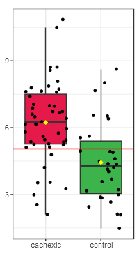
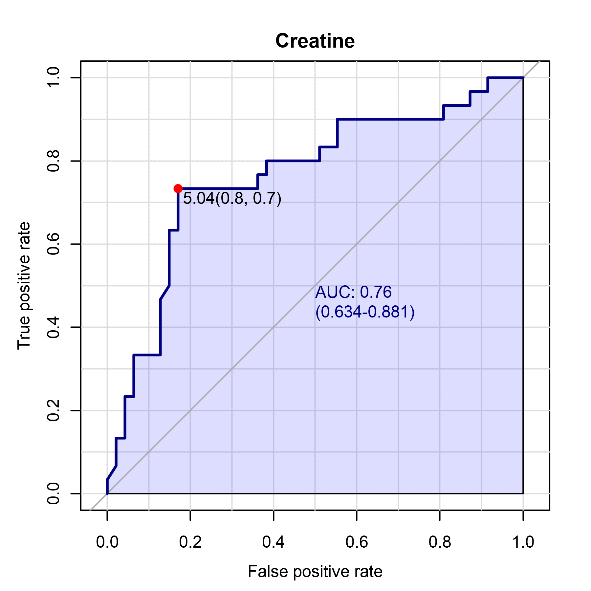
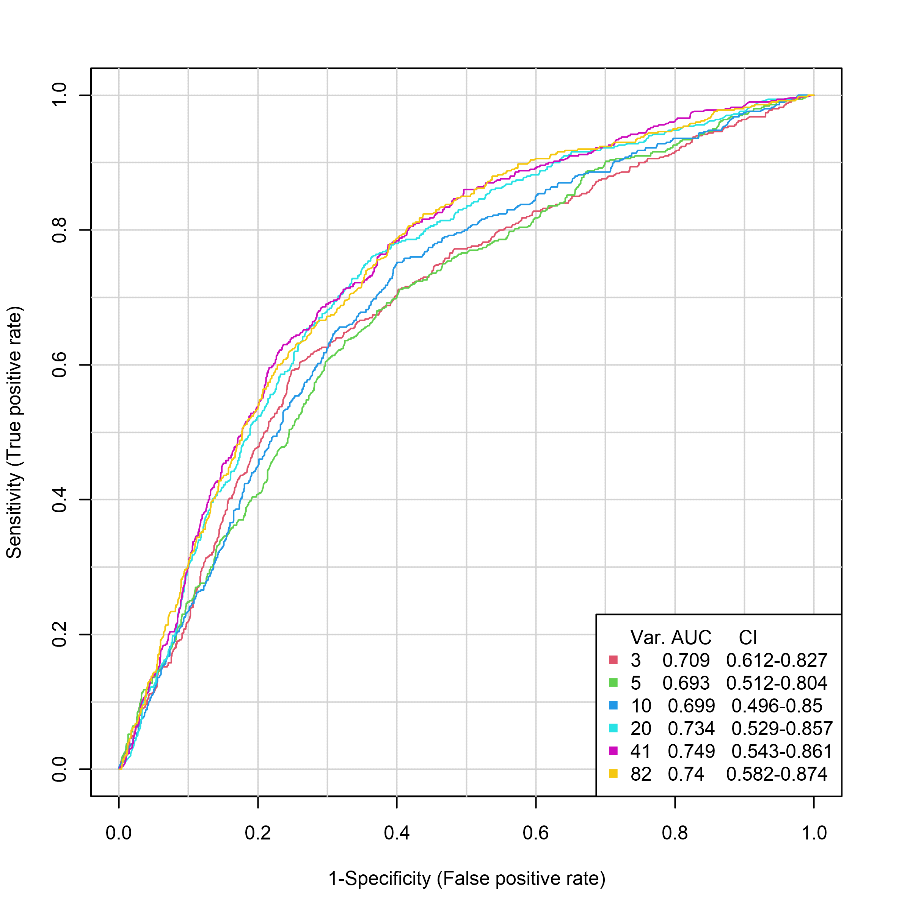
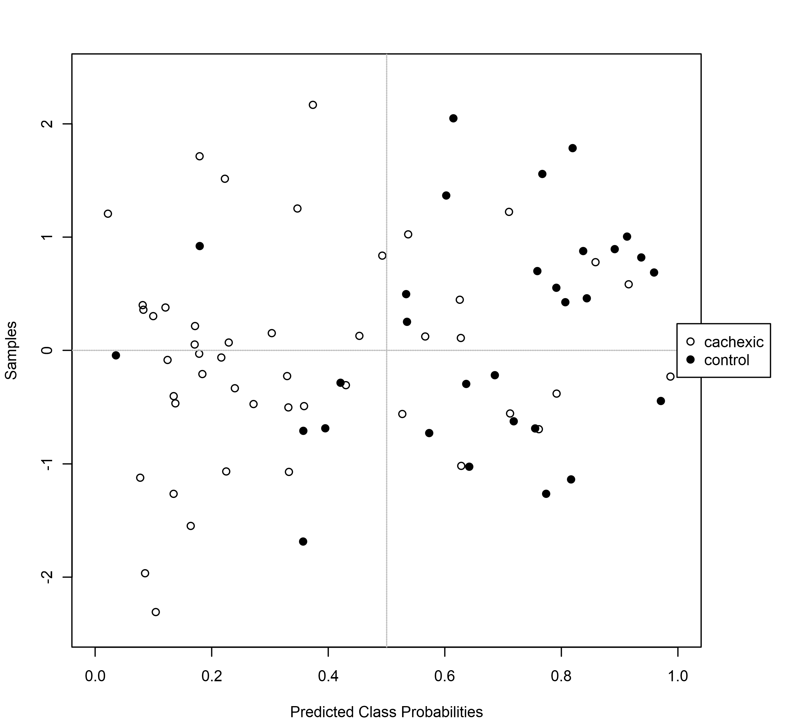
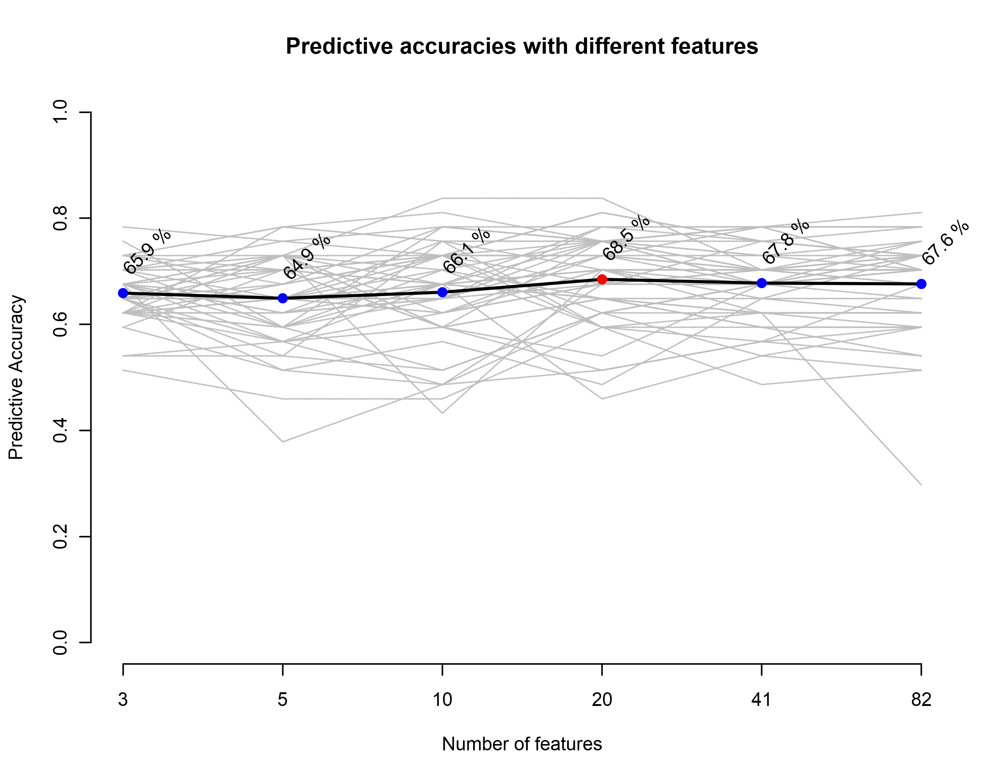

```{r setup, include=FALSE}
knitr::opts_chunk$set(echo = TRUE)
```

# Biomarker Analysis with MetaboAnalystR

## Installation

```{r, eval=FALSE}
# Install dependencies
metanr_packages <- function(){

  metr_pkgs <- c("impute", "pcaMethods", "globaltest", "GlobalAncova", "Rgraphviz", "preprocessCore", "genefilter", "sva", "limma", "KEGGgraph", "siggenes","BiocParallel", "MSnbase", "multtest","RBGL","edgeR","fgsea","devtools","crmn","httr","qs")
  
  list_installed <- installed.packages()
  
  new_pkgs <- subset(metr_pkgs, !(metr_pkgs %in% list_installed[, "Package"]))
  
  if(length(new_pkgs)!=0){
    
    if (!requireNamespace("BiocManager", quietly = TRUE))
        install.packages("BiocManager")
    BiocManager::install(new_pkgs)
    print(c(new_pkgs, " packages added..."))
  }
  
  if((length(new_pkgs)<1)){
    print("No new packages added...")
  }
}
metanr_packages()

# Install MetaboAnalystR
install.packages("devtools")
library(devtools)
devtools::install_github("xia-lab/MetaboAnalystR", build = TRUE, build_vignettes = FALSE)
```

```{r}
# Import library
library(MetaboAnalystR)
```


## Importing data

```{r}
# Create objects for storing processed data from biomarker analysis
mSet<-InitDataObjects("conc", "roc", FALSE)
# Read in data and fill in the dataSet list
mSet<-Read.TextData(mSet, "https://www.xialab.ca/api/download/metaboanalyst/human_cachexia.csv")
# Sanity check, replace missing values, check if the sample size is too small
mSet<-SanityCheckData(mSet)
mSet<-ReplaceMin(mSet)
mSet<-IsSmallSmplSize(mSet)
mSet<-PreparePrenormData(mSet)
```

```{r, results='hide'}
###### *** OPTION 2 FOR NORMALIZATION
# No normalization, and computeS metabolite ratios and includeS the top 20 
mSet<-Normalization(mSet, "NULL", "NULL", "NULL", "C01", ratio=TRUE, ratioNum=20)

# If ratio = TRUE: view the normalized dataset including the top ranked ratios
# The ratios will be towards the end of the matrix 
mSet$dataSet$norm

#If ratio = TRUE: view just the top ranked included ratios
mSet$dataSet$ratio
```

## Classical ROC Curve Analysis

```{r}
# Set the biomarker analysis mode to perform Classical ROC curve analysis ("univ")
mSet<-SetAnalysisMode(mSet, "univ")
# Prepare data for biomarker analysis
mSet<-PrepareROCData(mSet)

### OPTION 1 Perform univariate ROC curve analysis ###
mSet<-Perform.UnivROC(mSet, feat.nm = "Creatine", version = "1", format="png", dpi=300, isAUC=F, isOpt=T, optMethod="closest.topleft", isPartial=F, measure="sp", cutoff=0.2)

# Create box plot showing the concentrations of the selected compound between the groups
mSet<-PlotRocUnivBoxPlot(mSet, "Creatine", version= "1", "png", 72, T, FALSE)
# Perform calculation of feature importance (AUC, p value, fold change)
mSet<-CalculateFeatureRanking(mSet)
```

The results of executing the above code are the following:

* `metaboanalyst_roc_univ.csv` (numeric results for AUC, p-value, FC and clusters)
* `Creatine_box_1dpi72.png` (Boxplot for both groups)
* `Creatine_1dpi300.png` (ROC curve)

Here we can see the resulting images:

```{r, echo=FALSE, fig.cap="Creatine_box_1dpi72.png", fig.align="center"}

```


```{r, echo=FALSE, fig.cap="Creatine_1dpi300.png", fig.align="center"}

```

## Multivariate ROC Curve Explorer

```{r}
# Set the biomarker analysis mode to perform Multivariate exploratory ROC curve analysis ("explore")
mSet<-SetAnalysisMode(mSet, "explore")

# Prepare data for biomarker analysis
mSet<-PrepareROCData(mSet)

# Perform multivariate ROC curve analysis, using SVM classification and ranking
mSet<-PerformCV.explore(mSet, cls.method = "svm", rank.method = "svm", lvNum = 2)

### OPTION 1 Comparison plot of ROC curves of all models ###
mSet<-PlotROC(mSet, imgName = "ROC_all_models", format = "png", dpi = 300, mdl.inx= 0, avg.method = "threshold", show.conf = 0, show.holdout = 0, focus="fpr", cutoff=0.5)

# Plot predicted class probabilities for each sample for a selected model, not showing labels of wrongly classified samples
mSet<-PlotProbView(mSet, imgName = "multi_roc_prob", format = "png", dpi = 300, mdl.inx = -1, show = 0, showPred = 0)

# Plot the predictive accuracy of models with increasing number of features
mSet<-PlotAccuracy(mSet, imgName = "multi_roc_accuracy", format = "png", dpi = 300)

# Plot the most important features of a selected model ranked from most to least important
mSet<-PlotImpVars(mSet, imgName = "multi_roc_impvar", format="png", dpi=300, mdl.inx = -1, measure="freq", feat.num=15)
```

The results of executing the above code are the following:

* `ROC_all_modelsdpi300.png`: ROC curve plot
* `multi_roc_probdpi300.png`: Probabilities plot
* `multi_roc_accuracydpi300.png`: Predictive accuracies plot
* `multi_roc_impvardpi300.png`: ranking of important features plot
* `roc_pred_prob.csv`: numeric data for ROC curve
* `imp_features_cv.csv`: feature importance numeric data

Here we can see the resulting images:

```{r, echo=FALSE, fig.cap="ROC_all_modelsdpi300.png", fig.align="center"}

```

```{r, echo=FALSE, fig.cap="multi_roc_probdpi300.png", fig.align="center"}

```

```{r, echo=FALSE, fig.cap="multi_roc_accuracydpi300.png", fig.align="center"}

```

```{r, echo=FALSE, fig.cap="multi_roc_impvardpi300.png", fig.align="center"}
knitr::include_graphics("multi_roc_impvardpi300.png")
```

